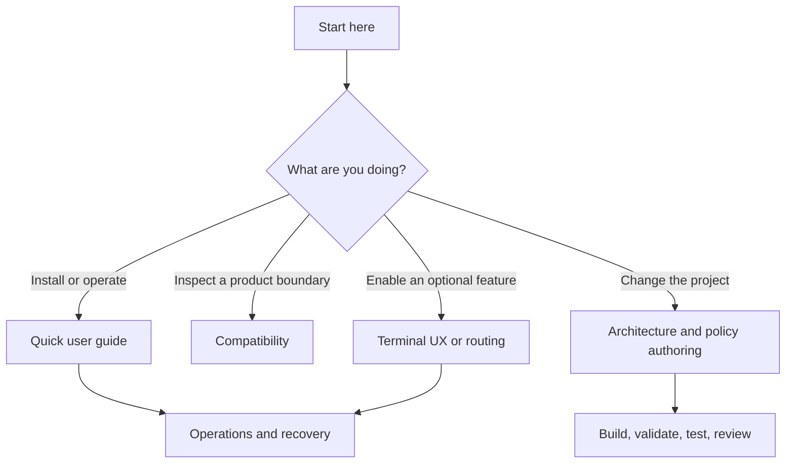

# Operator documentation

This is the documentation entry point for people operating, extending, or reviewing AI Engineering Workstation Guardrails. The root [README](../README.md) stays intentionally short; this directory owns the detail.

## Choose your path

| Audience | Start here | Then use |
| --- | --- | --- |
| Engineer installing the guardrails | [Quick user guide](user-guide.md) | [Operations](operations.md), [compatibility](compatibility.md) |
| Engineer using installed guardrails day to day | [Quick user guide](user-guide.md#day-to-day-use) | [skills catalogue](skills.md), [capability packs](capability-packs.md) |
| Engineer enabling status, receipts, or demo mode | [Terminal UX](terminal-ux.md) | [compatibility](compatibility.md#terminal-ux-capability-verification-2026-08-09) |
| Engineer delegating bounded tasks | [Routing and cost](routing-and-cost.md) | [skills catalogue](skills.md) |
| Contributor changing behavior or generated output | [Policy authoring](policy-authoring.md) | [Architecture](architecture.md), [CONTRIBUTING.md](../CONTRIBUTING.md) |
| Release maintainer | [Releasing to PyPI](releasing.md) | [operations](operations.md#release-checklist), [changelog](../CHANGELOG.md), [security policy](../SECURITY.md) |
| Security or platform reviewer | [Threat model](threat-model.md) | [architecture](architecture.md), [compatibility](compatibility.md) |
| Enterprise or Spacelift reviewer | [Enterprise output](enterprise.md) | [Spacelift](spacelift.md) |

## Document map

- [Quick user guide](user-guide.md): install, product-specific manual steps, day-to-day commands, and removal.
- [Operations](operations.md): preflight, update, state, recovery, waivers, auditing, scanning, and risk evidence.
- [Compatibility](compatibility.md): dated vendor capability evidence, supported formats, version boundaries, and product limitations.
- [Terminal UX](terminal-ux.md): opt-in status-line profiles, activity, complexity signals, compact receipts, demo mode, privacy, and removal.
- [Routing and cost](routing-and-cost.md): profile selection, role use, escalation, native product boundaries, and measurement limits.
- [Capability packs](capability-packs.md) and [skills catalogue](skills.md): on-demand stack support and portable workflows.
- [Architecture](architecture.md): canonical resources, build, installation, enforcement, and ownership boundaries.
- [Policy authoring](policy-authoring.md): how maintainers safely extend canonical policy, skills, packs, or command rules.
- [Threat model](threat-model.md): assumptions, non-goals, limitations, and operational mitigations.
- [Releasing to PyPI](releasing.md): Trusted Publishing setup, protected-environment approval, release-tag checks, and first-release procedure.

For reporting and contribution expectations, see the repository-level [security policy](../SECURITY.md), [contribution guide](../CONTRIBUTING.md), [code of conduct](../CODE_OF_CONDUCT.md), and [changelog](../CHANGELOG.md).

## Reading principles

Product documentation, local state, and a successful command are evidence of different things. A configured file is not proof that a product activated it; a detected model or tool is not proof of entitlement; and a clean scan is not proof that an arbitrary operation is safe. The guides label these limits rather than hiding them.
