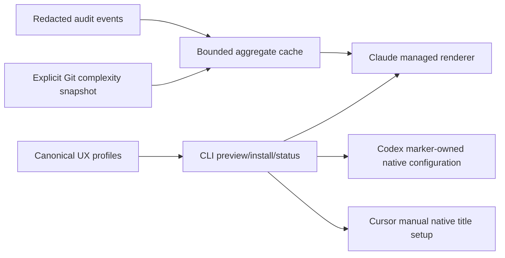
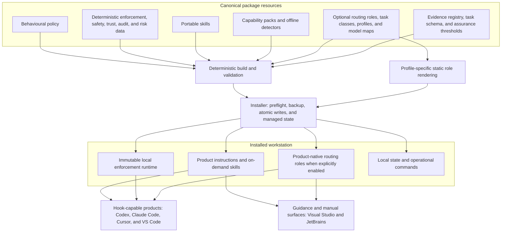
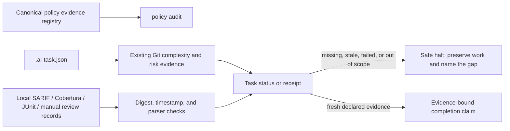

# Architecture

## Optional terminal UX

The optional terminal UX reuses the canonical resources, existing immutable-runtime ownership, redacted audit stream, receipt, and installation state. It is not a scheduler, vendor telemetry system, or terminal wrapper.

Only Claude receives an executable renderer in a content-addressed runtime. Codex receives one explicit, TOML-validated, marker-owned `tui.status_line` edit; Cursor remains user-configured through documented title indicators. Neither path sends data over a network or captures prompt/source content. See [terminal UX](terminal-ux.md) for the current product boundaries.

The repository separates authoring from delivery so product adapters can change without forking behavioural policy.

Enterprise and Spacelift platform-policy examples remain reviewable repository output outside the workstation installation path; build, validation, and tests never deploy them.

## Canonical sources

`ai_engineering_guardrails/_resources/` is the single canonical read-only resource root. Within it, `policy/manifest.json` establishes fragment order, stable identifiers, product applicability, descriptions, classifications, per-product output limits, and an 8 KiB always-loaded-policy budget. Markdown under `policy/fragments/` contains vendor-neutral behavioural content. `skills/` contains repeatable procedures that should not consume every session's instruction budget; the [skills catalogue](skills.md) explains the shipped core and pack skills, their product locations, and their activation limits. `enforcement/command-policy.json` defines deterministic denial intent and examples; the Python package's `enforcement.py` provides bounded parsing and strategy implementations without executing payload data.

Persistent context is scarce. Keep always-loaded policy for high-value behavioural and safety guidance that an agent cannot reliably discover. Put detailed procedures in Skills, implement hard restrictions as deterministic controls where practical, and leave repository-discoverable facts in the repository. Keep skill descriptions concise and put task and trigger terms first.

`routing/` is a fourth canonical resource area, but it does not participate in behavioural or enforcement authority. The [routing guide](routing-and-cost.md) owns the engineer-facing workflow. Task classes and profiles hold portable tiers, reasoning, parallelism, capabilities, attempts, and thresholds. Model maps are the only canonical files containing vendor model IDs. Role Markdown and shared context guidance generate static product-native role files. `ai-guardrails` does not inspect prompts, classify work at runtime, schedule agents, enforce profile concurrency, promote a running task, or broker model calls; the engineer, primary agent, and native product decide whether to use an installed role. The metrics schema defines an optional content-free record shape, but the repository installs no collector or uploader.

`evidence/` and `assurance/` are compact canonical metadata areas. They provide policy evidence/review records, the bounded task-contract shape, and component/skill audit thresholds. Python code imports only local JSON, SARIF, Cobertura, or JUnit reports supplied by the repository owner. It never launches an analyzer, model, skill, or component; report bodies, source snippets, command text, prompts, and secrets are not retained in state.

`packs/` is the canonical stack-specific and cross-cutting layer. Every language, infrastructure, delivery, operations, or shared pack owns a manifest and includes only the policy, skill, verification, routing, deterministic-control, detector, or fixture surfaces that its capability needs. A markerless shared specialist pack can contain only its manifest and portable skill. `packs explain` reads the declared policy, verification, and routing guidance that exists; it does not create a second routing or verification engine or load pack prose globally. Detector-bearing packs support several simultaneous matches in a monorepository while pruning build output, caches, vendored code, and configured generated directories. Detection has no installation authority and does not contact a toolchain or network.

`config/safety-profiles.json` is independent of `routing/profiles/`. It maps `observe`, `validate`, `mutate`, `destructive`, `sensitive-read`, `publish`, `privilege-escalation`, and `guardrail-modification` to lifecycle-aware treatment. `config/targets.example.json` documents the local `~/.ai-guardrails/targets.json` mapping for Ansible inventories, Kubernetes, Helm, Spacelift, Azure/cloud, Terraform, and database identifiers. Canonical lifecycle values are `dev`, `tst`, `int`, and `prd`; unknown targets are protected.

`platform-policies/spacelift/` contains configuration-driven organisation-policy examples. They are outside workstation installation and are never attached, updated, or deleted by build, validation, or tests.

The root `AGENTS.md` is repository contribution guidance, not the global policy's canonical source. `CLAUDE.md` imports it so repository instructions are not duplicated. Cursor can consume the same root `AGENTS.md`, so this project does not add a redundant `.cursor/rules` file.

## Build flow

`python tools/guardrails.py build` validates the canonical behavioural and generated-artifact inputs it consumes before rendering. `validate` additionally checks every pack manifest, verification definition, and routing hint. Build uses manifest order, fixed headers, stable JSON key order, no timestamp, configured byte limits, and exactly one final newline. It generates:

- a concise Codex aggregate;
- one Claude user-rule file per applicable fragment;
- a pasteable Cursor User Rules document;
- portable skill copies;
- balanced-profile custom-agent output for all six products, with JetBrains retained as a reviewable manual bundle;
- product hook fragments, Codex prefix rules, and the Cursor CLI permissions recommendation.

The JSON fragments retain a placeholder for the installed engine path. Installation copies the standalone standard-library runtime and selected policy into a content-addressed directory, then builds native entries with that immutable absolute path and `sys.executable`; repository artifacts therefore remain machine independent and installed hooks do not depend on the clone.

All routing profiles are validated on every routing validation, while version-controlled `dist/` agents represent the recommended balanced profile. A profile-specific installation renders from the same canonical roles, selected profile, and product model map. Each generated role has one fixed task class; that class determines the role's tier and reasoning at render time. The renderer emits the resolved model for Codex, Claude Code, and Cursor, while intentionally leaving model selection native for VS Code, Visual Studio, and JetBrains. The remaining portable task classes and capability-pack routing hints are validated guidance, not a dynamic router that retargets an installed role during a session. This avoids maintaining profile copies in `dist/` while keeping the automation boundary explicit.

## Installation flow

The CLI resolves authored sources from its package-local `_resources` tree. Installation and update never infer a repository from the caller's working directory; repository capability detection is an explicit, offline `packs detect --repo <path>` or `packs explain --repo <path>` operation. Omitted product selection reuses local executable, configuration, and managed-state evidence. A no-write dry preflight computes and validates the deterministic build, detects products, and checks collisions and backup needs before using the same installation path. Managed files use atomic replacement. Existing configuration is parsed and semantically merged; unrelated keys and hook groups are preserved. Existing files are backed up before first mutation, and state records only relative managed paths, content hashes, backup paths, product ownership, and format metadata.

Codex and Cursor share skill destinations. State records both owners, so uninstalling one product does not remove a skill still owned by the other. Claude receives a separate copy in its documented personal skill directory.

Routing installation is opt-in. Native agent files are copied to the documented user agent directory for Codex, Claude, Cursor, VS Code, and version-unverified Visual Studio; JetBrains receives only a reviewable manual Copilot bundle because its customizations are Preview and no stable personal path is assumed. The state records the selected profile, managed hashes, explicit model overrides, and manual activation steps—never prompts, task content, or actual model use. Status resolves the configured mappings on demand and reports availability as `unverified`; it cannot prove that a product discovered a role or used the displayed model. Routing operations do not edit a main-model setting or global concurrency setting. Concurrency and escalation are portable instructions because native products do not expose one common safe user-level enforcement surface.

VS Code can load Claude-compatible hooks. The installer uses a tiny recorded ownership choice rather than a general dependency graph: when a managed Claude hook is present, VS Code uses it as `shared-claude`; otherwise VS Code owns its Preview-native hook. Claude is registered before a native VS Code hook is removed, and VS Code is restored to a native hook before Claude is removed. Visual Studio and JetBrains are behavioural/skill adapters only: neither receives a fabricated deterministic hook.

Fresh consumer installation compiles deterministic enforcement from all stable packs but copies only contextual language/shared pack skills; specialist infrastructure, delivery, operations, and cross-cutting shared skills remain packaged but out of the default global catalogue. Product-provided discovery determines whether a compatible agent uses detailed guidance, and pack policy is not concatenated into global instructions. `--skill-catalogue` changes managed skill exposure independently; repeatable `--pack` remains a deliberately reduced policy/skill set. A fresh installation defaults to the non-mutating `infrastructure-observe` profile. State tracks policy packs and skill packs separately alongside safety/trust/routing profiles, paths, hashes, backups, and manual steps. Unmanaged collisions are preserved, and forced replacement is backed up.

Uninstallation reconstructs ownership from state rather than generated Markdown. Files, directories, managed blocks, and hook entries each have kind-specific verification. A local modification is retained by default. Parent directories are removed only when empty and only from a small known list beneath the selected home.

## Enforcement flow and parser boundary

The hook reads one JSON object from standard input. For shell tools it locates the command field, tokenises without evaluation, unwraps common `sudo`, `env`, shell `-c`, PowerShell `-Command`, and `cmd /c` forms, and inspects simple chained segments. Pack classifications then apply the active lifecycle safety profile. For structured tools it normalises product MCP naming, matches provider/tool metadata, and inspects only declared fields such as GraphQL operation documents or Intent verbs. A matching policy returns the cross-compatible nested `PreToolUse` denial with a stable identifier and operation class. Allowed or unrecognised operations produce no approval object.

Arguments are never serialised to diagnostics or state. Structured rules declare target identifiers and fields that must never be logged. Unknown structured tools fail open with a redacted diagnostic unless a deliberately configured strict allowlist is active; recognised dangerous tools fail closed. Shell and structured coverage remain product-hook coverage, not arbitrary-process mediation.

The parser deliberately does not expand variables, command substitutions, aliases, functions, wildcard contents, sourced scripts, or arbitrary shell grammar. This conservative boundary reduces false positives. Malformed input produces a payload-free stderr diagnostic and exits successfully; a confidently matched denial is closed and specific.

## Governance and operability flow

`explain` and `simulate` call the same evaluator with waiver consumption disabled and never execute the request. Rule rollout is data: disabled produces no decision; observe audits; warn audits and uses a safe diagnostic; deny translates to a documented product response. Waivers are exact digest/repository/target/rule matches with expiry and use counts. Audit JSONL is rotated during writes and contains only schema-approved hashes and classifications.

`scan` is deliberately independent from enforcement. It enumerates repository files, applies conservative static checks, and renders human, JSON, SARIF, or JUnit output. `docs audit` reuses its bounded Markdown reading for two advisory clarity checks and has no rewriting or compliance authority. Risk data maps changed high-risk paths to a named canonical requirement and checks that local evidence declares every named review and verification outcome; it does not execute commands or claim to prove an external review. Installed state—not generated Markdown—drives status, diff, update, and uninstallation.

## Evidence and task assurance flow

This is a validation and reporting boundary, not a command runner or semantic analyzer. A receipt cannot prove product correctness, full analyzer coverage, or external-review quality. Component inspection follows the same boundary: it is bounded static reading and digest comparison, not an execution sandbox or publisher signature system. See [evidence and assurance](evidence-and-assurance.md).

## Simplicity boundaries

All executable domain logic is Python 3.11+ standard library in one ordinary package and a thin entry point. Rich is the sole direct runtime dependency and is isolated to one human CLI presentation boundary. That boundary renders help, errors, operation logs, properties, comparable records, and findings at the current terminal width with an 80-column ceiling; long operational values fold without ellipsis. Machine formats and exact pasteable instruction/setup payloads bypass the renderer. The implementation otherwise uses direct JSON, small data records, explicit functions, and static registries. There is no plugin framework, dynamic code loading, shell helper, packaging framework, database, service, background process, network installer, telemetry uploader, semantic YAML/Rego/SQL parser, or second domain-logic path. Pack variation is data-driven because more than three packs share a stable schema; product rendering remains explicit where formats materially differ.
