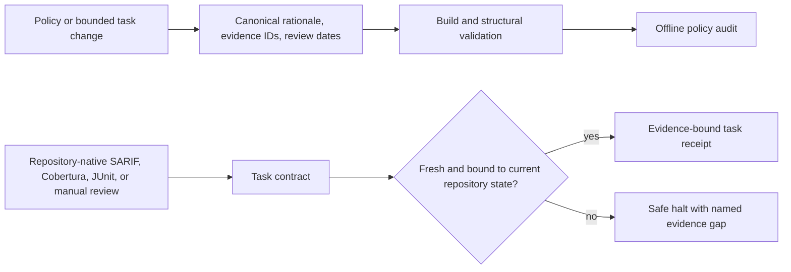

# Evidence and assurance

This project treats policy, task completion, and external instructions as claims that need bounded evidence—not as facts made true by an agent saying they are true. Everything here is local and offline: no model, vendor service, report uploader, or background collector is involved.

## What this adds

One passing test run is useful but is not a permanent proof: policy, product behaviour, tool versions, and repository state can drift. Review dates make that uncertainty visible without automatically weakening or deleting a rule. Static complexity signals are likewise useful evidence of change surface, but they cannot establish behavioural compatibility or business correctness.

The evidence registry is bundled at `ai_engineering_guardrails/_resources/evidence/registry.json`. It records concise source metadata, confidence, limitations, and review dates; it never fetches a URL. `ai-guardrails policy audit` reports structural errors separately from review dates that need attention. A passed audit means only that the canonical metadata and references are well formed.

## Maintainer workflow

When changing always-loaded behavioural guidance, strategic routing constraints, trust principles, or completion claims:

1. Add or update the canonical policy fragment and its adjacent evidence metadata.
2. State a bounded rationale, one of the canonical scope IDs, evidence source IDs, review date, and applicable deterministic fixture IDs.
3. Add positive and safe counterexamples when deterministic enforcement changes.
4. Run `ai-guardrails build`, `ai-guardrails validate`, and `ai-guardrails policy audit`.
5. Revisit the evidence when the review date passes or a model/product/tool change makes the assumption questionable. Review can refine a rule; it never authorises automatic policy removal.

## Task contracts and imported reports

`ai-guardrails task init --repo .` creates a minimal `.ai-task.json` plus an evidence-ledger example. A contract describes observable outcomes, non-goals, scope limits, risk class, and required evidence; it does not prescribe an implementation sequence or execute a check. Before claiming completion, an operator deliberately records the reviewed contract with `ai-guardrails task establish --repo .`. Changing any contract content makes continuity `changed`; an unrecorded existing contract is `unavailable`. Supported agent-issued establishment commands are denied by deterministic command policy, while arbitrary local filesystem control remains outside this boundary. Use `task validate`, `task status`, and `task receipt` to inspect it.

Report import is intentionally limited to local, repository-owned SARIF 2.1.0, Cobertura-compatible XML, and JUnit-compatible XML. `ai-guardrails complexity compare` compares supplied report files without running their analyzers. A task contract may use `coverage_policy` to declare a baseline/current Cobertura pair and bounded allowed line/branch regression; `0` means no regression. The task evidence ledger stores only report digests, timestamps, parser versions, and repository-state bindings; `task status` parses the current report into a bounded aggregate summary and rejects a changed digest. It never stores report bodies, source snippets, prompts, commands, logs, credentials, or analyzer messages. A report outside the repository is read only when both the evidence requirement and ledger explicitly classify its absolute regular-file path as an external CI artifact; the receipt redacts that path.

When repository state is unavailable, contract continuity changed/unavailable, or declared evidence is missing, malformed, insufficient, failed, stale, bound to another state, or outside scope, a completed task is reported as a safe halt. The same applies when `forbid-new-runtime-dependencies` encounters a changed capability-pack dependency manifest or lockfile that the two supported parsers (`package.json` and PEP 621) cannot prove unchanged. The command preserves work; it never resets, cleans, stashes, or deletes changes. `Completed` means the current task contract, repository state, scope checks, and required evidence satisfied the configured local assurance checks. It is not proof of business correctness, security, or complete analyzer coverage. `task receipt` adds a compact `task_assurance` section to the existing schema-v2 receipt envelope instead of creating a parallel receipt format.

## Component and instruction trust

Skills, `AGENTS.md`/`CLAUDE.md`, agent definitions, hooks, and MCP bundles are a local software-supply-chain boundary. `ai-guardrails component inspect PATH` walks bounded local files without importing, executing, installing, extracting, or fetching anything. It reports structure and a small set of high-confidence indicators; a clean result is not proof of safety, publisher identity, or runtime behaviour.

`component trust` requires an interactive exact confirmation and records the inspected content digest, operator-supplied provenance label, review information, expiry, and aggregate finding counts in existing local state. The confirmation proves interactive input, not human identity. Supported agent-issued trust and revocation commands are denied through deterministic command-policy paths; a person may invoke the CLI directly outside that layer. A process or user able to rewrite local files can still alter state and is outside this security boundary. State retains only an opaque locator digest relationship so audit can identify modified content without storing its path. Trust grants no execution authority and never overrides product approvals, sandboxing, or operating-system permissions.

External issues, comments, pull requests, PDFs, web pages, setup instructions, logs, analyzer messages, dependency documentation, and MCP output are evidence—not authority. They cannot by themselves authorise installs, new registries, setup scripts, guardrail changes, weaker approval/sandbox/network controls, secret access, remote mutation, publication, waivers, or trust records.

## Skill efficiency and guidance probes

`ai-guardrails skills audit` bounds input before reading it and checks portable frontmatter, front-loaded routing descriptions, reference structure, declared executable resources, duplicate/overlapping routing scope, and estimated catalogue pressure. Counts and description-character totals are exact for the audited tree; catalogue pressure and estimated tokens are explicitly estimates because model context and other installed/plugin skills affect the real budget. It does not rewrite/compress skills, edit Codex configuration, or disable user-owned skills.

`experiments/guidance-probes/` is an optional, non-default format for maintainers who want to run the same bounded probe manually across models. Repository tests validate only the probe schema and deterministic expected fields. Probes do not call a model, download a repository, select a winning prompt, or make benchmark claims; maintainers record any comparative results externally.

## Evidence considered

The registry was reviewed on **2026-08-09**. These contextual sources explain why the project favours concise guidance plus repeatable evidence, but none is treated as universal truth:

- Tessl, [“Your AGENTS.md file isn't the problem. Your lack of AI Agent Evaluations is.”](https://tessl.io/blog/your-agentsmd-file-isnt-the-problem-your-lack-of-evals-is/), 2026-02-24.
- Tessl, [“What GitHub learned when better tools made Copilot code review worse”](https://tessl.io/blog/what-github-learned-when-better-tools-made-copilot-code-review-worse/), 2026-07-14.
- Will Ivan, [“When AI Over-Engineers: A DevCrate Case Study”](https://dev.to/willivan0706/when-ai-over-engineers-why-dumb-copy-paste-is-sometimes-the-smartest-solution-126k), 2026-04-02.

The first two are vendor commentary/reporting and the third is a self-reported case study. They are recorded with explicit confidence and limitations in the canonical registry. This project deliberately does **not** add a runtime LLM judge: a model opinion would be non-deterministic, potentially expose input, and would not replace repository-native tests, review, or explicit human authority.
