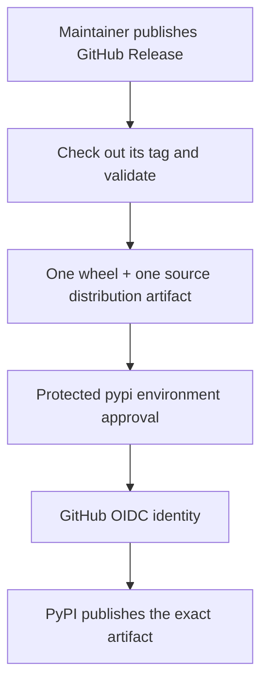

# Releasing to PyPI

Production releases are published to [PyPI](https://pypi.org/project/ai-engineering-guardrails/) through GitHub OIDC Trusted Publishing. The workflow deliberately publishes only after a human publishes a GitHub Release; it never publishes from a branch push, pull request, schedule, tag push, or local checkout.

## Verified release assumptions — 2026-08-09

- [PyPA's GitHub Actions publishing guide](https://packaging.python.org/en/latest/guides/publishing-package-distribution-releases-using-github-actions-ci-cd-workflows/) recommends a restrictive build job, an artifact hand-off, a protected publishing environment, and Trusted Publishing instead of stored API tokens.
- [PyPI Trusted Publishers](https://docs.pypi.org/trusted-publishers/using-a-publisher/) use GitHub OIDC identity. The publisher must match the configured project, owner, repository, workflow filename, and (when configured) environment.
- [The official PyPA publishing action](https://github.com/pypa/gh-action-pypi-publish) requires `id-token: write` without a username or password for Trusted Publishing. It publishes attestations by default in that mode.

The production workflow is `.github/workflows/publish-pypi.yml`. It accepts the repository convention `v<package-version>`: a package version of `1.2.3` must be released from tag `v1.2.3`. Pre-release versions use the same rule, for example `1.2.3rc1` and `v1.2.3rc1`.

## Trusted Publisher configuration

The following was required before the first release and remains the configuration to verify before changing the release workflow. Do not add a duplicate publisher or a registry secret merely because a release is already live.

### GitHub

1. Open **Repository → Settings → Environments → New environment**.
2. Create the environment named `pypi`.
3. Configure one or more required reviewers. This is strongly recommended: the job waits for approval after it has built and validated the release artifacts.
4. Do not add a PyPI token or any other registry credential. This workflow uses OIDC only.

### PyPI

Sign in to PyPI, open **Account settings → Publishing**, and add a Pending Trusted Publisher with these exact values:

| Setting | Value |
| --- | --- |
| PyPI project name | `ai-engineering-guardrails` |
| GitHub owner | `ZarrenSpryXplor` |
| GitHub repository | `ai-engineering-guardrails` |
| Workflow filename | `publish-pypi.yml` |
| GitHub environment | `pypi` |

For a project that already exists, add the same values from that project's **Publishing** page instead. A Pending Trusted Publisher can create the project on the first successful publication; it does **not** reserve the package name before then. PyPI and TestPyPI are separate services with separate publisher configuration and independently immutable uploaded versions.



The build job has read-only repository permission and no OIDC publishing permission. The publish job neither checks out source nor builds packages; it downloads only the validated artifact, has `id-token: write`, and runs the official PyPA publisher. A duplicate version fails loudly—there is no `skip-existing` setting. The PyPA action produces PyPI publish attestations by default; this repository does not add custom signing code.

## Each release

1. Ensure `main` is clean, protected, and all required CI checks are green.
2. Review [CHANGELOG.md](../CHANGELOG.md) and confirm the intended version in `ai_engineering_guardrails.__version__`:

   ```sh
   ai-guardrails --version
   ```

3. Ensure that version is already committed. The workflow will not change it or infer it from Git.
4. Create and push the matching tag—normally a signed annotated tag according to your release policy:

   ```sh
   git tag -s v<package-version> -m "Release v<package-version>"
   git push origin v<package-version>
   ```

5. Create a GitHub Release for that exact tag, review the release notes manually, then publish the GitHub Release.
6. Watch the **Publish to PyPI** workflow. Its build job checks the tag/version match, regenerates and checks committed output, validates canonical data, runs the full unit suite and compile check, scans the repository, builds `release/`, runs strict Twine validation, and accepts exactly one wheel and one source distribution.
7. After the build succeeds, review and approve the protected `pypi` environment.
8. Verify the new release on PyPI, then test it from a fresh isolated environment:

   ```sh
   pipx install ai-engineering-guardrails
   ai-guardrails --version
   ai-guardrails install --dry-run
   ```

Do not recreate an existing GitHub Release or re-upload a PyPI version to force a run. PyPI versions are effectively immutable. A workflow merged after an already-published GitHub Release does not retroactively publish that release; use the next deliberate, matching version and Release event.

## TestPyPI

No TestPyPI workflow is included. A manual Trusted Publishing rehearsal would duplicate the restrictive build and privileged publish jobs, while the official PyPA action does not support Trusted Publishing from reusable workflows. Add a separate, explicitly reviewed TestPyPI workflow later only if its maintenance cost is justified; it requires a distinct `testpypi` GitHub Environment and a separate TestPyPI Trusted Publisher.

## User installation

Install the published package from a clean environment:

```sh
pipx install ai-engineering-guardrails
ai-guardrails --version
ai-guardrails install --dry-run
```

For contributor work, use a reviewed clone or wheel instead of treating a moving Git branch as a release artifact.
