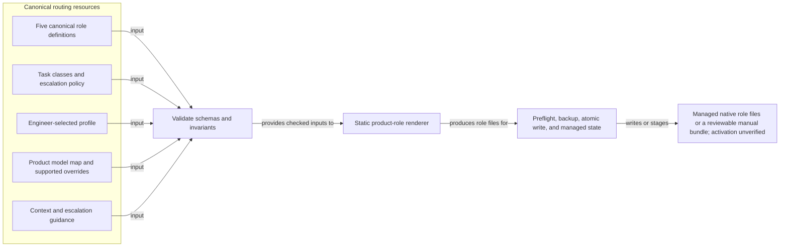
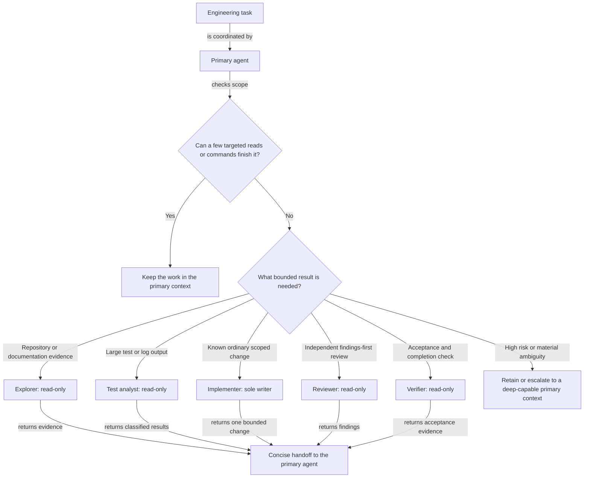

# Routing and cost

[Quick user guide](user-guide.md) · [Skills catalogue](skills.md) · [Product compatibility](compatibility.md) · [Architecture](architecture.md)

Routing is optional configuration for product-native roles. It is separate from behavioural policy, deterministic enforcement, safety profiles, trust modes, and product approvals. A lower-tier or lower-reasoning role never grants authority, changes what work is allowed, or reduces required review.

The most important mental model is simple: `ai-guardrails` installs static role definitions; it is not a live task router. It does not inspect prompts, classify work during a session, schedule agents, enforce concurrency, promote a running task, confirm the model actually used, or collect usage data. The engineer, primary agent, and product-native agent system decide whether to use an installed role.

## What routing changes

When routing is explicitly enabled, the installer combines four inputs:

- each of the five canonical role definitions;
- the role's fixed task class and the selected `economy`, `balanced`, or `quality` profile;
- the product's model map and any supported explicit override;
- shared context, output, concurrency, and escalation guidance.

It renders those inputs into the product's native custom-agent format and records the managed files, profile, and overrides in local state. Routing does not:

- change the primary session model;
- change a safety or trust profile;
- broaden or rewrite the primary session's approval, sandbox, network, credential, or tool settings; supported read-only roles intentionally request narrower role-local restrictions;
- set a product-wide concurrency value;
- make a product load a skill automatically;
- prove that the product discovered the role or that an account can use the configured model.

`none` is the fresh-install default and creates no managed routing roles. `balanced` is the recommended starting profile, but it must be selected explicitly.

## How routing is rendered

This current-state data-flow view is for operators and maintainers. It shows how selected routing data becomes static product-native role files; it does not show runtime task classification.



Task classes are configuration data, not commands an engineer invokes. Each generated role has one fixed task class, which determines its tier and reasoning when the file is rendered. The renderer emits the resolved role model for Codex, Claude Code, and Cursor; it intentionally omits that field for VS Code, Visual Studio, and JetBrains so selection remains native to those products. Capability-pack routing hints shown by `packs explain` are advisory and do not dynamically modify an installed role.

## Choose a profile

Profile names and capability tiers are different concepts. Profiles are `none`, `economy`, `balanced`, and `quality`; the tiers inside an enabled profile are `economy`, `balanced`, and `deep`.

The three role columns show the exact five-role rendering today. `tier / reasoning` describes static role configuration, not a guarantee about product availability or runtime selection.

| Profile | Explorer and test analyst | Implementer | Reviewer and verifier | Maximum concurrent read-only agents |
| --- | --- | --- | --- | ---: |
| `none` | Not installed | Not installed | Not installed | 0 |
| `economy` | economy / low | balanced / low | balanced / low | 1 |
| `balanced` | economy / low | balanced / medium | balanced / medium | 2 |
| `quality` | balanced / high | balanced / high | deep / high | 3 |

Every enabled profile permits one writing role and forbids parallel writers. Canonical attempt and scope guidance is one attempt, eight files, and one subsystem for `economy`; two attempts, 12 files, and two subsystems for `balanced`; and two attempts, 16 files, and two subsystems for `quality`. Those values remain engineer-side guidance and are not rendered numerically into native role files or enforced by `ai-guardrails`. The engineer and native product must keep actual delegation within the selected limits.

Use `economy` for narrow, routine work where startup overhead is justified but ordinary reasoning can stay low. Start with `balanced` for normal engineering work. Use `quality` when stronger exploration, interpretation, independent review, or verification justifies the additional context, latency, and usage. A profile should not be enabled merely because roles exist.

## Install or change routing

Always preview and name the product you intend to change. `routing set` operates only on an existing managed installation and otherwise fails safely. Its default product selection is `all`, so an explicit `--product` avoids accidentally selecting products that are not installed.

Inspect a profile without writing:

```sh
ai-guardrails routing show --profile balanced --product codex
```

Enable it during a fresh managed installation:

```sh
ai-guardrails install --product codex --routing-profile balanced --dry-run
ai-guardrails install --product codex --routing-profile balanced
ai-guardrails status --product codex --show-routing
```

Change an existing managed installation:

```sh
ai-guardrails routing set quality --product codex --dry-run
ai-guardrails routing set quality --product codex
ai-guardrails status --product codex --show-routing
```

Replace `codex` with the selected product. Omitting `--routing-profile` on a fresh install leaves routing at `none`; omission on a later install or update preserves the saved per-product profile and model overrides.

`routing show` displays bundled profile and default model-map data. It does not read installed state or saved overrides. `routing validate` checks the bundled routing schemas and render inputs; it does not test model entitlement, native discovery, or runtime activation.

After installation, start or reload the relevant product session and confirm the roles are visible through that product's agent UI or diagnostics. `status --show-routing` reports the managed state and resolves the saved mappings; it deliberately reports model availability as `unverified` and cannot prove native activation.

## Use roles in an engineering session

Do not delegate a task that the primary agent can complete with a few targeted reads or commands. Delegate when separate context, bounded high-volume output, specialist analysis, one isolated ordinary change, or independent verification materially improves the work.

This decision flow is for a coordinating engineer or primary agent. It selects one bounded role or retains the work; it does not grant authority or select a model dynamically.



The diagram shows products that delegate a role from a coordinating primary agent. On a selectable custom-agent surface such as VS Code or Visual Studio, the engineer may instead activate the role directly; the same scope, capability, escalation, and review boundaries still apply, but the role returns to the engineer rather than to a parent agent.

The five canonical roles are:

| Role | Use it for | Capability | Useful return |
| --- | --- | --- | --- |
| `workstation_explorer` | Bounded repository mapping, symbol discovery, or authoritative documentation research that would pollute the primary context. | Read-only | Relevant paths or sources, conclusions, unresolved questions, and evidence. |
| `workstation_test_analyst` | Bounded build, test, lint, type-check, or log output that needs deterministic grouping and failure classification. | Read-only | Command outcome, root failure signatures, likely ownership, uncertainty, and checks not run. |
| `workstation_implementer` | One ordinary isolated change after expected behaviour, scope, files, and acceptance criteria are known. | Sole writer | Bounded diff, targeted verification, assumptions, and unmet criteria. |
| `workstation_reviewer` | Independent correctness, security, regression, failure-behaviour, compatibility, and maintainability review. | Read-only | Severity-ordered findings with evidence, or an explicit no-findings result and residual gaps. |
| `workstation_verifier` | Independent confirmation of acceptance criteria, generated output, tests, installation safety, and final scope. | Read-only | Supported, unsupported, or partially supported result for each material claim. |

Every delegation should state the objective, exact scope, modification permission, expected return, completion criteria, and escalation conditions. For example:

> Use `workstation_explorer` to map the authentication flow. Keep it read-only. Return only the relevant files, ownership boundaries, unresolved questions, and evidence. Stop if a public contract or security decision appears.

For products that use hyphenated native names, request `workstation-explorer` instead. A typical ordinary change can use one explorer, then the sole implementer after scope is known, followed by a reviewer or verifier. Do not run two implementers in parallel or assign overlapping writes.

## Roles, skills, and controls work together

A routing role describes **who** receives a bounded task, or which custom role the engineer selects, and its intended capability tier. Products with delegated subagents may start an isolated context; directly selected custom-agent surfaces need not do so. Codex, Claude Code, and Cursor receive an explicit role model, while the other renderers deliberately defer model selection to the product. A [skill](skills.md) describes **how** to perform a category of work. Behavioural policy, deterministic hooks, product approvals, safety profiles, and trust modes decide what remains allowed.

For example, ask for the `workstation_implementer` role as the sole bounded writer and the `workstation-python` skill as the Python-specific procedure. Installing the role does not preload or invoke that skill automatically; discovery and activation remain product-controlled.

> Use `workstation_implementer` as the sole writer and follow the `workstation-python` skill. Scope is `src/parser.py` and `tests/test_parser.py`; preserve the public API and add no dependency. Reproduce the failure, implement the smallest fix, and run `python -m unittest tests.test_parser -v`. Return changed files, exact check outcomes, assumptions, and unmet criteria. Stop if the fix requires another subsystem, a public-contract change, or more than two viable designs.

Capability-pack hints can help choose a relevant procedure:

```sh
ai-guardrails packs explain --repo .
```

Those hints do not grant permission, select a model, or feed a runtime task classifier.

## Product experience and native names

Canonical role IDs use underscores. Codex preserves those names; the other generated products use hyphens.

| Product | Default delivery | How an engineer uses it | Important boundary |
| --- | --- | --- | --- |
| [Codex](https://developers.openai.com/codex/agent-configuration/subagents) | `$CODEX_HOME/agents/*.toml`, normally `~/.codex/agents/` | Ask the primary session to delegate by role name; use `/agent` to inspect agent threads where supported. | Read-only roles request a read-only sandbox; parent settings can take precedence. |
| [Claude Code](https://code.claude.com/docs/en/sub-agents) | `~/.claude/agents/*.md` | Name the role in natural language or select it through the `@` agent typeahead. | Parent permission mode and `CLAUDE_CODE_SUBAGENT_MODEL` can take precedence; the installer never sets that variable. |
| [Cursor](https://cursor.com/docs/subagents.md) | `~/.cursor/agents/*.md` | Ask Agent to use the named role; Cursor may also choose a role from its description. | `readonly` and explicit model selection remain product controls subject to plan or organisation fallback. |
| [VS Code](https://code.visualstudio.com/docs/agent-customization/custom-agents) | `~/.copilot/agents/*.agent.md` | Select the custom role in Chat when routing is enabled. | Model is omitted so the active picker remains authoritative; role availability is product-controlled. |
| [Visual Studio](https://learn.microsoft.com/en-us/visualstudio/ide/copilot-specialized-agents?view=visualstudio) | `%USERPROFILE%\.github\agents\*.agent.md` | Select or `@`-mention the custom role where the installed version supports it. | Availability is version-dependent; these are user-selectable roles, not subagents, and model/tool restrictions are omitted. |
| [JetBrains Copilot](https://docs.github.com/en/copilot/reference/customization-cheat-sheet) | `~/.ai-guardrails/manual/jetbrains/agents/` | Review the bundle, open the Copilot Customizations editor, add the roles manually, and select the required role in chat. | Custom agents are Preview and the exact UI varies by plugin version; model/tool restrictions are omitted and the bundle path is not claimed as a live product directory. |

See [product compatibility](compatibility.md) for current format, version, path, permission, and fallback details. A file on disk is not proof of activation, model entitlement, or actual model use. Product read-only metadata is useful defence in depth, not a workstation security boundary.

## Escalation and high-risk work

The canonical data maps architecture, security, authentication and authorisation, cryptography, distributed systems, complex concurrency, production infrastructure, destructive data migration, and public-contract work to the `deep` tier. That mapping is a validated routing invariant and escalation guide; it is not a runtime classifier.

Only five task classes currently back generated roles. Under the `balanced` profile, none of those five roles is deep. The implementer explicitly refuses unresolved architecture, security-sensitive work, production infrastructure, destructive migration, and public-contract changes. High-risk work must therefore remain with or escalate to a deliberately selected deep-capable primary context. The `quality` profile provides deep reviewer and verifier roles for independent checking, but it still does not create a high-risk writing role or replace human-controlled approvals.

Stop or escalate when evidence conflicts, material requirements remain ambiguous, more than two viable paths remain, a trust boundary or public contract appears, production or persistent data is involved, bounded diagnosis is exhausted, scope thresholds are crossed, verification is inconsistent, or the current context is insufficient. Economy roles may collect high-risk evidence but must not make the final decision.

## Model maps and overrides

The configured maps are Codex Luna/Terra/Sol and Claude `haiku`/`sonnet`/`opus` for economy/balanced/deep. Cursor, VS Code, Visual Studio, and JetBrains default to `inherit`. These are configuration values, not evidence of account entitlement or actual runtime selection.

Explicit tier overrides are meaningful for Codex, Claude Code, and Cursor. Preview the complete desired override set before applying it:

```sh
ai-guardrails routing set balanced --product cursor \
  --model-override cursor:economy=provider/model-id \
  --dry-run

ai-guardrails routing set balanced --product cursor \
  --model-override cursor:economy=provider/model-id
```

When one or more overrides are supplied for a selected product, that supplied set replaces the product's previously saved override set; repeat every override you intend to retain. The syntax validator does not contact the vendor or prove the ID is available. Vendor fallback or substitution is product-controlled and is different from the engineer-driven escalation described above.

Do not set model overrides for VS Code, Visual Studio, or JetBrains. Their renderers intentionally omit a model so the native picker or manual product surface remains authoritative.

## Inspect, troubleshoot, and disable

Use local state and managed-file checks when a role is missing or looks stale:

```sh
ai-guardrails status --product codex --show-routing
ai-guardrails diff-installed --product codex
ai-guardrails doctor --product codex
```

Unmanaged collisions and locally modified managed roles are preserved by default. Review the reported file and backup plan before considering `--force`; do not edit `.ai-guardrails/state.json` manually.

If the selected product has no saved model override, reconfigure its managed installation with routing disabled:

```sh
ai-guardrails routing set none --product codex --dry-run
ai-guardrails routing set none --product codex
```

The transaction removes obsolete managed role files and preserves unmanaged custom roles, but it still runs the normal full-product preflight and installation path. It can refresh other stale managed output and, for hook-capable products, replace the immutable runtime and hook target because the managed-path metadata changed. Review the dry run as a product configuration change, not as a surgical file deletion.

Current limitation: a saved model override prevents `routing set none` because the CLI refuses to retain an override without an enabled profile and does not yet provide a clear-overrides flag. Do not bypass that check by editing state. Product uninstall/reinstall is a much broader operation that temporarily removes all managed guardrails and must not be treated as a routine override-clearing shortcut; resolving this case requires a separate, explicitly reviewed product-maintenance decision.

## Context and output efficiency

Native roles search before large reads, use targeted ranges, avoid rereading unchanged data, run narrow tests before broad suites, request terse output where supported, and summarise bounded logs without losing exit status or diagnostically useful failures. No output-filtering or command-rewriting hook is installed.

## Measurement limits

The future-facing content-free metrics schema can represent product, model, task class, tier, reasoning, subagent count, available token counts, duration, retries, escalations, and outcome. It currently enumerates Codex, Claude Code, and Cursor records. It excludes prompts, source, commands, arguments, secrets, credentials, and tool output. This repository installs no record writer, collector, uploader, dashboard, or cost calculator.

API-token billing, included subscription usage, product credits, third-party model pools, and list-price estimates are different accounting systems. Lower latency is not the same as lower cost, and extra subagent contexts can increase tokens. Use product-native usage information and compare representative completed tasks; do not promise exact monetary savings.

Terminal UX keeps this distinction explicit: context capacity, native token activity, native rate-limit windows, Claude's session cost estimate, local guardrail events, and complexity signals are independent fields rather than one synthetic usage score. It does not infer a bill from tokens or routing tiers. See [terminal UX](terminal-ux.md) for the opt-in local status-line and compact-receipt workflow.

## Evaluate before changing routing

Treat a routing change as a small configuration experiment, not a model popularity contest. Start with 10–20 representative, bounded tasks and compare the same tasks against the current profile. Record only outcome, unnecessary files or dependencies, diff size, verification result, retries, duration, and product-native token data when it is available. Include at least one task where the correct answer is to make no code change and one that can expose unnecessary abstraction.

Keep the comparison local or use product-native reporting. Do not upload prompts, source, commands, or logs; do not add a telemetry collector or an LLM evaluation framework. A configuration should remain unchanged unless it produces reliable task outcomes with no material increase in unnecessary edits or verification failures.

- [Codex pricing and plans](https://developers.openai.com/codex/pricing)
- [Claude Code costs and `/usage`](https://code.claude.com/docs/en/costs)
- [Cursor models and pricing](https://cursor.com/docs/models-and-pricing.md)
