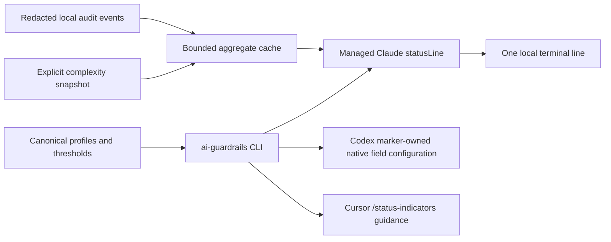

# Terminal UX

Terminal UX is an optional local explainability layer. It displays product-native context or account information only where the product documents it, plus compact local guardrail and complexity signals. It is not telemetry: nothing is sent to a vendor or third party, no billing/account store is read, and no vendor session JSON is persisted.



The cache contains only time bounds, content-free decision/rule/product aggregates, a complexity classification, and fixed schema metadata. It never contains prompts, source, commands, arguments, paths, repository names, raw events, vendor payloads, or credentials.

## Start with a preview

Ordinary installation is unchanged. Terminal UX is opt-in:

```sh
ai-guardrails statusline preview --product all --profile standard
ai-guardrails statusline install --product all --profile standard --dry-run
ai-guardrails statusline install --product all --profile standard
ai-guardrails statusline status
```

`compact` shows guardrail posture, model/reasoning, context, and a supplied Git branch. `standard` also shows documented rate-limit state, estimated session cost/duration, effort, and last-24-hour local warning/denial counts. `fun` adds transparent context heat and a recent repository-keyed `KISS` complexity classification. Leaving `--statusline-profile` out keeps terminal UX disabled.

Every line is one line by default, drops low-priority segments first in narrow terminals, works without colour, honours `NO_COLOR` by emitting no ANSI styling, and uses ASCII when its output encoding is not Unicode-capable. Missing product fields are omitted, never fabricated.

## Product boundaries

### Claude Code: managed command status line

Claude Code documents a `statusLine` object in `~/.claude/settings.json` whose command receives session JSON on standard input. The installer structurally merges one fixed command using the absolute installed Python interpreter and the immutable renderer at `~/.ai-guardrails/runtime/<digest>/terminal_renderer.py`. It preserves unrelated settings and hooks, refuses an unmanaged or modified `statusLine` unless `--force` is explicit, makes a backup before replacement, and removes only its own entry on uninstall.

The renderer is standard-library-only, local, non-networked, performs no repository scan or subprocess, reads one JSON document in memory, and exits successfully with no output for malformed data. It uses only documented fields such as `model.display_name`, `context_window.used_percentage`, `rate_limits`, `cost.total_cost_usd`, `cost.total_duration_ms`, and `worktree.branch`. Cost is labelled `est` because Claude documents it as a client-side session estimate, not an invoice.

Claude runs the configured command only after the current workspace is trusted. `disableAllHooks` disables custom status lines too. Installation proves the managed configuration exists; it cannot prove that a particular workspace accepted trust or that a product session activated it. `COLUMNS` is used for width when Claude supplies it (documented for Claude Code 2.1.153+).

### Codex: native configuration, no custom renderer

Codex documents `/statusline`, which configures and persists the native TUI footer in `tui.status_line` in `config.toml`. An explicit status-line installation makes one narrow, marker-owned edit of that key: it validates the complete TOML first and after the edit, preserves comments, order, unrelated keys, and all other `[tui]` settings, and creates a backup before replacement. An unmanaged `tui.status_line` is preserved unless `--force` is explicit. Uninstall removes only the marker-owned key block.

```sh
ai-guardrails statusline print-codex-setup --profile standard
```

`[tui]` is TOML syntax in Codex's user `config.toml`; it is **not** an item or screen inside the `/statusline` picker. The picker shows the native fields themselves and persists its selection to `tui.status_line` behind the scenes. To have this project make its reviewable marker-owned TOML edit, preview then opt in explicitly:

```sh
ai-guardrails statusline install --product codex --profile standard --dry-run
ai-guardrails statusline install --product codex --profile standard
```

Alternatively, use `/statusline` alone and leave the native selection user-managed. If a user-managed `tui.status_line` already exists, the installer reports an unmanaged collision and leaves it untouched unless `--force` is explicit.

The managed profile uses only exact IDs in the current official sample: `model-with-reasoning`, `context-remaining`, `git-branch`, and `current-dir`. Use the `/statusline` picker to add version-specific rate-limit or token items from the current Codex build. Use `/status` for current model/approval/root/token information and `/usage` for native account token activity. `/pets` is an optional Codex choice and is never enabled here. Codex does not document an arbitrary external footer renderer, so local guardrail counters and complexity signals remain available through `receipt --compact`, `activity`, and `complexity`, not the Codex footer.

### Cursor CLI: native title indicators only

Cursor CLI documents `/status-indicators` to toggle terminal-title indicators. It does not document an arbitrary status-line command or a `/usage` command. `statusline install --product cursor` therefore records only the exact manual/native step and does not write Cursor configuration, inspect private account data, scrape a terminal, or claim a programmable usage bar.

```sh
ai-guardrails statusline print-cursor-setup
```

## Local signals and receipts

```sh
ai-guardrails activity --since 24h
ai-guardrails complexity --repo .
ai-guardrails complexity --repo . --write-snapshot
ai-guardrails receipt --repo . --product all --compact
```

`activity` reports only content-free observed, warning, and denial decisions that supported hooks actually recorded. It is a time-window count, not a session count and not a complete allowed-operation count. It reports that Visual Studio and JetBrains do not have deterministic hook events. The status-line cache is bounded and safely ignores malformed events.

`complexity` reports deterministic repository-change observations from local Git data: changed files/lines, source/test/docs/generated/manifest/lockfile/CI/infrastructure paths, implementation languages, newly introduced languages, reliably extracted runtime dependencies, deleted tests, directory spread, and existing high-risk path classes. Every signal has a stable identifier, evidence, threshold, and reason. Its `clear`, `review`, and `high-change` classifications are review prompts, not a design-quality score or semantic verdict. `--write-snapshot` stores only aggregate values and a one-way repository identifier under the managed cache; it never executes repository scripts, fetches, contacts a remote, or runs a package manager.

`receipt --compact` is a repository/change summary, not a claimed vendor session boundary. It combines the version-2 receipt schema with bounded recorded-history audit counts, routing state, complexity result, and known verification gaps. It deliberately marks allowed-operation counts unavailable because supported hooks do not record every allowed operation. Status-line and `activity` counters remain explicitly time-windowed.

## Synthetic demonstration

```sh
ai-guardrails demo
ai-guardrails demo --scenario infrastructure
ai-guardrails demo --format json
```

Demo data is fixed and synthetic. It shows policy decisions, status-line examples, and complexity classifications without executing the displayed commands, reading credentials, checking product installation, changing state, or contacting any service.

## Status, update, and removal

`statusline status` distinguishes managed configuration, modified/missing settings, an unmanaged collision, Cursor's manual native setup, and unverified activation. `statusline uninstall --product all` removes only the managed Claude `statusLine` and Codex marker-owned `tui.status_line`; it preserves hooks and all unrelated settings. Core `uninstall` removes the same managed status-line integration for its selected product. User-created receipts and complexity snapshots are preserved.

`install --statusline-profile standard` and `update --statusline-profile standard` opt in alongside the normal managed installation. Later `update` refreshes an already managed terminal-UX integration while preserving its selected profile; fresh ordinary installs still receive no cosmetic mutation when the option is omitted.
